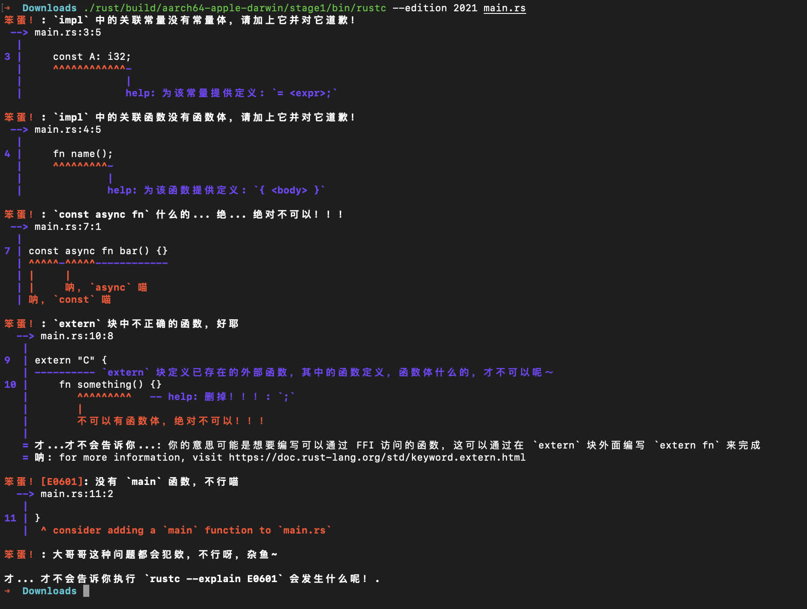

# rustc 也要变得可爱！！！


灵感来源于 [Bili-Haku/kawaii-gcc](https://github.com/Bill-Haku/kawaii-gcc).

## 项目状况
> **警告：这是不完善的实验性项目。当前完成度相对较低并可能在未来变更。将仅维护“适用版本”（即更新时的 stable 版本）的 patch。
 - 适用版本：Rust **1.76.0**

## 安装
```bash
 $ git clone --depth=1 https://github.com/sisungo/experiments.git
 $ git clone -b stable --depth=1 https://github.com/rust-lang/rust.git
 $ cd rust
 $ git am ../experiments/experiments/kawaii-rustc/patches/0001-rustc-ha-kawaii-desu.patch
 $ ./x.py build # Build your version of rustc
```
